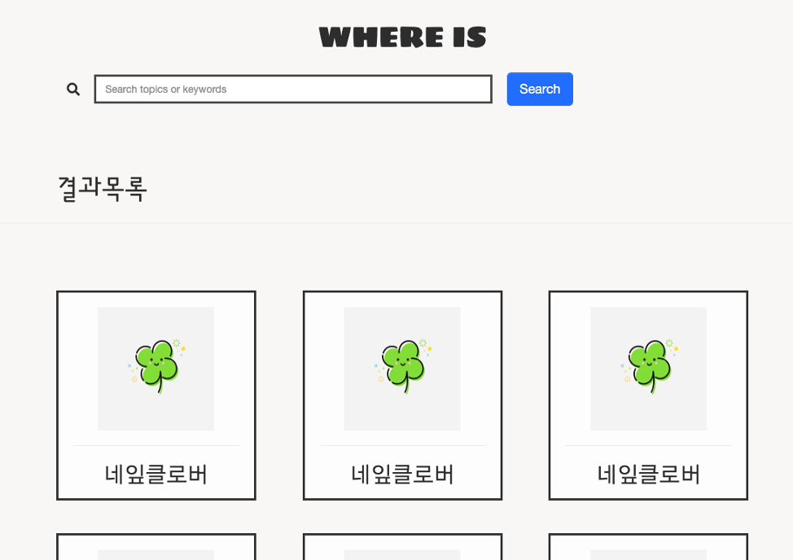

# 한번의 검색

1. 내가 보고 싶은 영상이 넥플릭스에 있나? 왓차에 있나? 아니면, WAVVE, Seezn, 티빙,... 어디에 있을까?
2. 보고싶은 영상을 검색만 하세요~! 그 영상이 어디에 있고, OST 리스트도 다 말해드리겠습니다.

 

# 프로세스

사실 무엇부터 해야할지 모르겠지만, 핵심 기능인 검색부터 만들어보자.

1. 검색 UI 준비하기 (완료)

   

     
   

   

2. 데이터 가져오기

 

# 05/29

우아,,, 이미 저스트와치 라고 하는 서비스가 있네요,,,,

잠시 stop,,,

